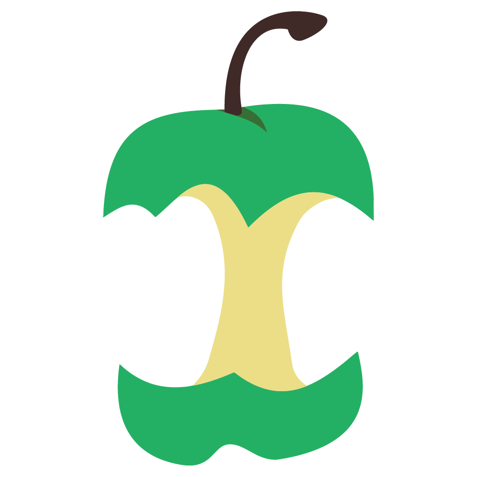

<h1 align="left">Hi, I'm Ali Hassan</h1>
<h3 align="left">A passionate Bioinformaticiean from Pakistan</h3>

  

<!--  -->

- I’m currently working on **long read and short read data.**

- I’m looking to collaborate on **finding variants responsible for rare diseases.**

<!-- - 📝 I regularly write articles on [www.bioinformaticsguy.info](www.bioinformaticsguy.info](https://www.bioinformaticsguy.info/) -->

- Ask me about **Bioinformatics.**

- How to reach me **bioinformaticsguy@gmail.com**

- Know about my experiences [https://www.bioinformaticsguy.info/portfolio/](https://www.bioinformaticsguy.info/portfolio/)

<h3 align="justify">Languages and Tools:</h3>

          
  &nbsp;
  &nbsp;
  &nbsp;
  &nbsp;
  

<h4 align="justify">Data Science:</h3>

  &nbsp;
  &nbsp;   
  &nbsp;  
  &nbsp;  
  &nbsp;  
  &nbsp;  
  &nbsp;  
  &nbsp; 

<h4 align="justify">Machine Learning:</h3>

  &nbsp;
  &nbsp;    
  &nbsp;

          
